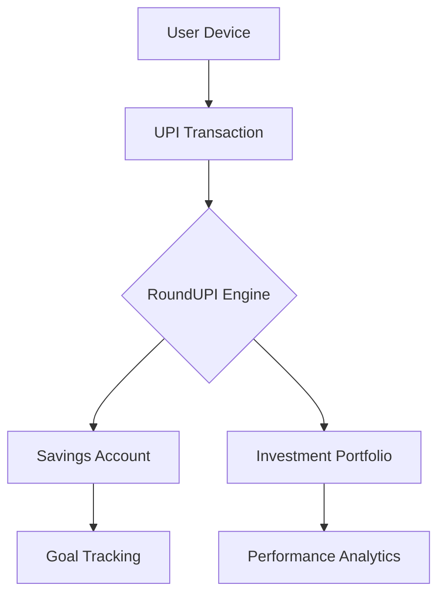

# RoundUPI - Smart Micro-Savings & Investment Platform

**RoundUPI** transforms everyday UPI transactions into automatic savings and smart investments, helping users grow their wealth effortlessly.

## 🌟 Key Features

### 💰 Core Functionality
- **Automatic Round-Ups** - Saves/invests the difference when rounding up transactions
- **Multi-UPI Integration** - Works with all major UPI providers
- **Goal-Based Savings** - Set and track financial objectives
- **Instant Notifications** - Real-time updates on transactions and savings
- **Secure Authentication** - 2FA and bank-level security

### 📈 Investment Tools
- **Diversified Portfolio Options** - Mutual funds, bonds, and ELSS
- **AI-Powered Recommendations** - Personalized investment strategies
- **Performance Analytics** - Track growth with detailed reports
- **Tax-Efficient Options** - Smart tax-saving investments

### 🎯 Advanced Features
- **Custom Round-Up Rules** - Set percentages or fixed amounts
- **Recurring Investments** - Schedule automatic contributions
- **Savings Challenges** - Gamified financial goals
- **Group Savings** - Collaborate on shared objectives
- **Market Insights** - Real-time financial data

## 🛠 Technology Stack
- **Backend**: Node.js/Express or Python Flask
- **Frontend**: React.js/React Native
- **Database**: PostgreSQL/MongoDB
- **APIs**: UPI, Mutual Fund, and Banking integrations
- **Security**: AES-256 encryption, JWT authentication
- **AI/ML**: Python (for recommendation engines)

## 🚀 Getting Started

### Prerequisites
- Node.js 16+ / Python 3.8+
- npm/yarn/pip
- UPI developer account (for sandbox testing)

### Installation
```bash
git clone https://github.com/jitenkr2030/roundupi.git
cd roundupi
npm install  # For backend and frontend
```

### Configuration
1. Create `.env` file with your:
   - UPI API credentials
   - Database connection strings
   - Encryption keys

2. Set up test accounts with UPI sandbox

## 📊 System Architecture


## 🤝 Contributing
We welcome contributions! Please:
1. Fork the repository
2. Create your feature branch
3. Submit a pull request

## 📜 License
MIT License - See [LICENSE](LICENSE) for details

## 📧 Contact
- **Developer**: [Jiten Kumar](https://github.com/jitenkr2030)
- **Business Inquiries**: contact@roundupi.com *(example)*

---

**RoundUPI - Making Every Transaction Count**  
*"Save without thinking, invest without worrying"*

